# Adidas Sales Intelligence & Business Performance Analysis
This project analyzes Adidas sales data to uncover insights into revenue, profitability, product performance, regional sales trends, and retailer effectiveness. Using SQL, Python, Excel, and Power BI, the project transforms raw sales data into interactive dashboards and business intelligence reports that support data-driven decision-making and sales forecasting.

BUSINESS PROBLEM
Adidas operates across multiple regions, retailers, and product categories, generating large volumes of sales data. However, decision-making is limited without clear visibility into performance trends, profitability drivers, and regional contributions. This project addresses the need for a centralized analytics system to improve strategic decisions.

PROJECT OBJECTIVES
- Analyze overall sales and profitability performance
- Identify top-performing products and regions
- Evaluate retailer contribution to revenue
- Discover seasonal sales trends
- Improve business decision-making using data insights
- Build forecasting models for future sales prediction

TOOLS & TECHNOLOGIES
- SQL (PostgreSQL)
- Python (Pandas, NumPy, Matplotlib)
- Microsoft Excel
- Power BI
- Jupyter Notebook
- GitHub for version control

PROJECT WORKFLOW
1. Data Collection and Loading
2. Data Cleaning and Preprocessing
3. Exploratory Data Analysis (EDA)
4. SQL-Based Data Analysis
5. Python Data Analysis
6. Dashboard Development (Power BI)
7. Business Insights Extraction
8. Sales Forecasting

KEY ANALYSIS PERFORMED
- Regional sales performance analysis
- Product profitability analysis
- Retailer performance ranking
- Monthly and quarterly sales trends
- Profit margin analysis
- Sales forecasting and trend detection

KEY INSIGHTS
- Certain regions contribute significantly higher revenue than others
- Footwear products generate the highest profit margins
- A small number of retailers account for a large portion of total sales
- Sales show seasonal spikes during specific periods
- Some products have high sales volume but low profitability

RECOMMENDATIONS
- Focus marketing efforts on high-performing regions
- Strengthen partnerships with top-performing retailers
- Reduce investment in low-profit products
- Increase inventory before peak sales seasons
- Optimize pricing strategies to improve profitability

PROJECT STRUCTURE
adidas-sales-intelligence-project/
│
├── data/
├── sql/
├── notebooks/
├── dashboards/
├── images/
├── reports/
├── presentation/
└── README.md

FUTURE IMPROVEMENTS
- Implement machine learning for advanced forecasting
- Automate dashboard updates
- Add real-time data integration
- Build interactive web dashboard

AUTHOR
Developed by: Damilola Oluwasegun  
Role: Data Analyst (Aspiring)  
Skills: SQL, Python, Power BI, Excel

## Power BI Dashboard Power BI was used to develop interactive dashboards and KPI reports that visualize sales performance, profitability, regional trends, retailer contribution, product performance, and time-based sales analysis. The dashboard enables data-driven decision-making through dynamic visual storytelling, filtering, and business intelligence insights.

## Adidas_Executive_Dasboard 
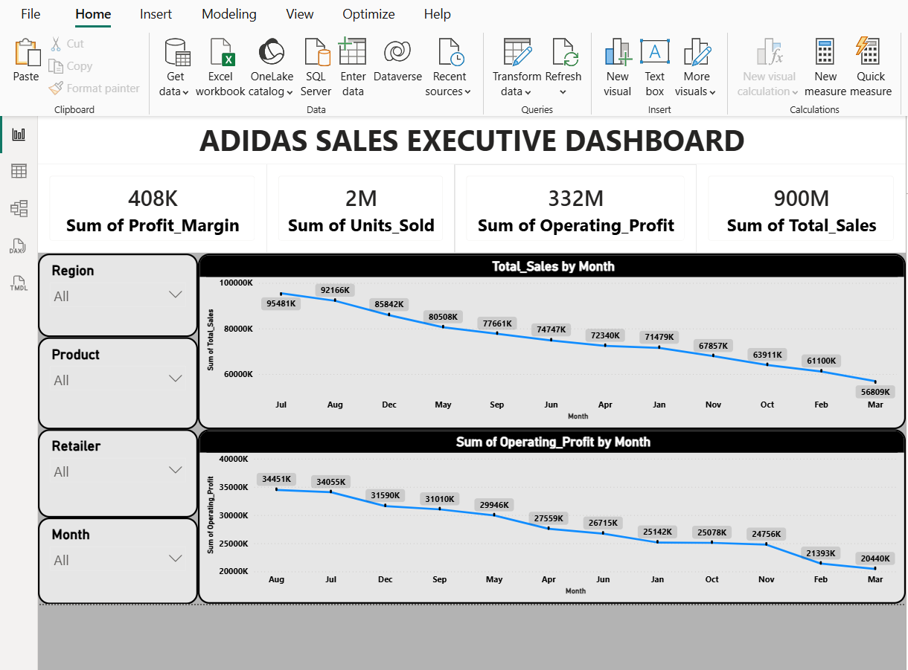 

# Regional Sales Analysis
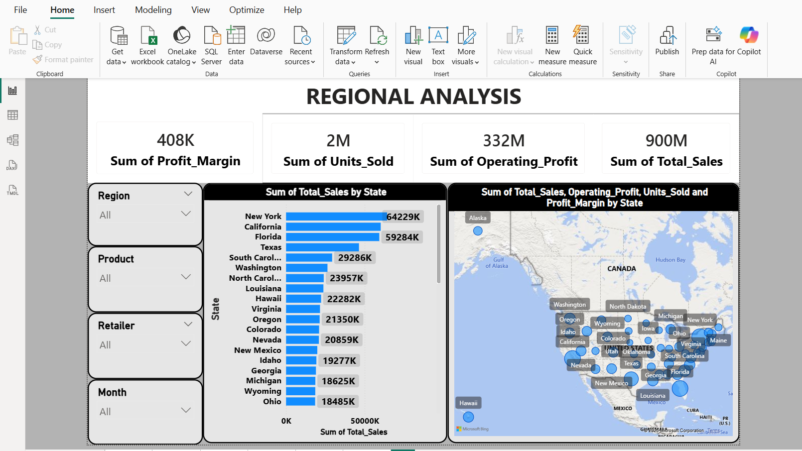 

# Monthly Sales Trend Analysis
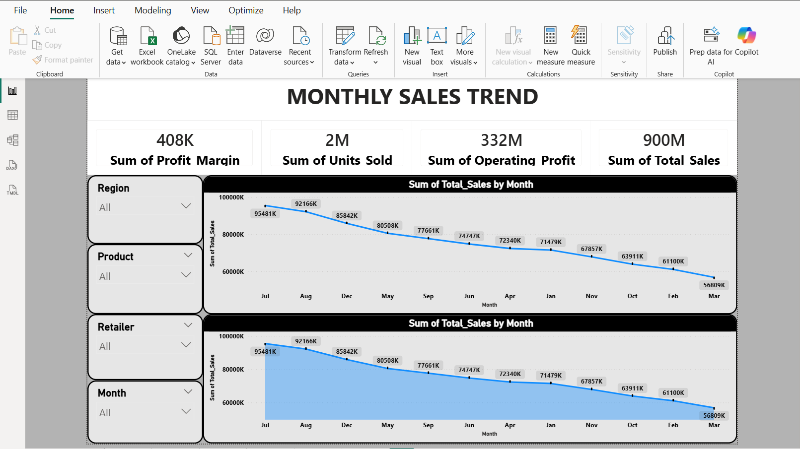 

# Product Revenue and Profit Analysis
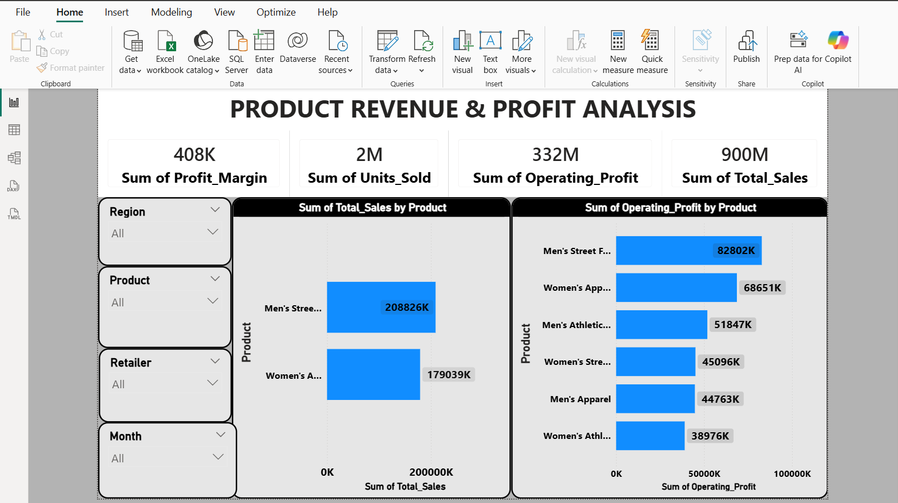

# Reataier Contribution Analysis
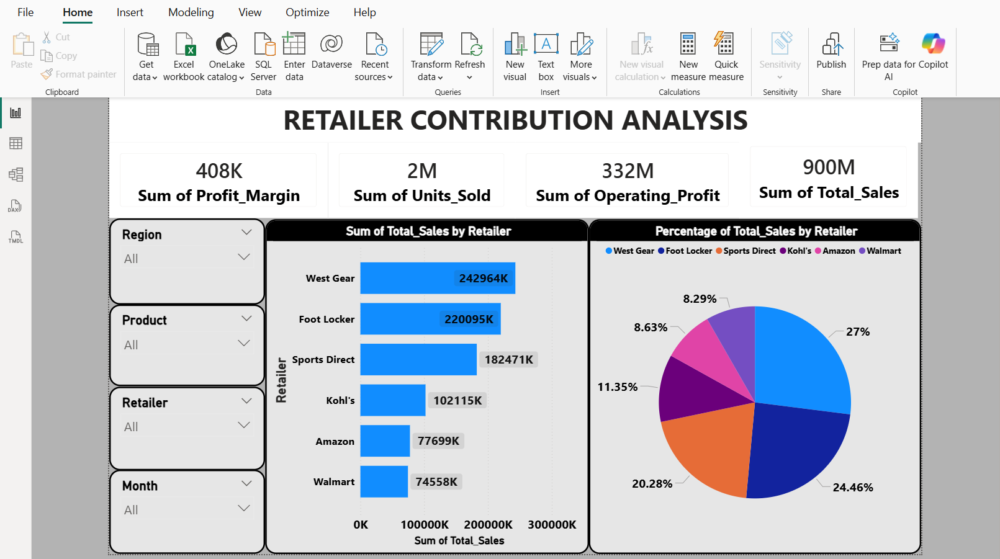

## Python Analysis Python was used for exploratory data analysis, data cleaning, visualization, and forecasting using Pandas and Matplotlib.

## Load_dataset
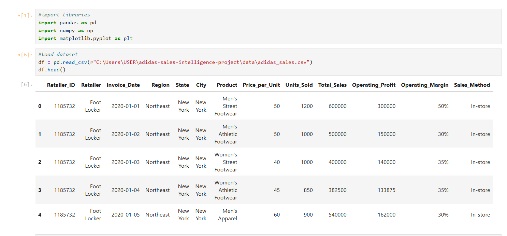

# Dataset info
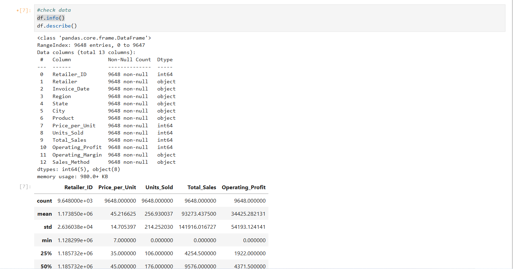

# Data Cleaning 
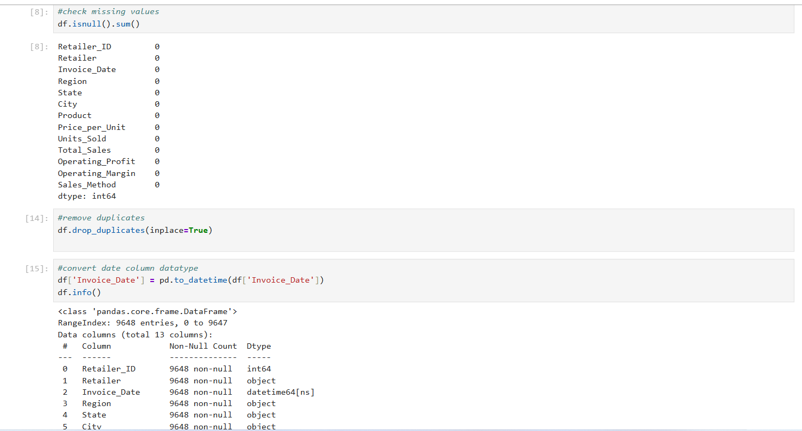

# Data Manipulation
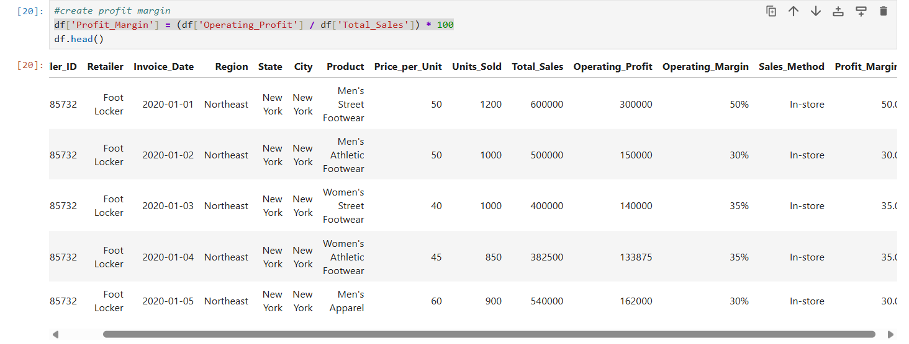

# Sales by Region
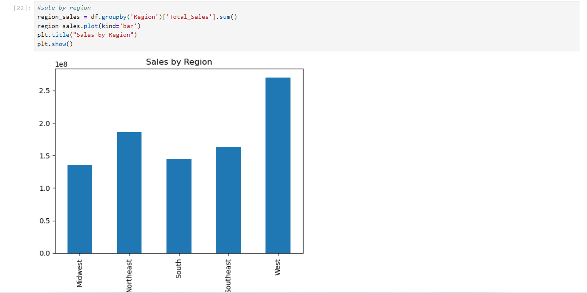

# Top Products
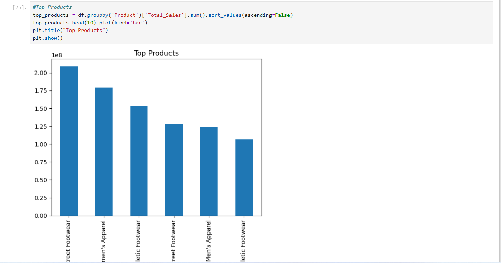

# Monthly Sales Trend
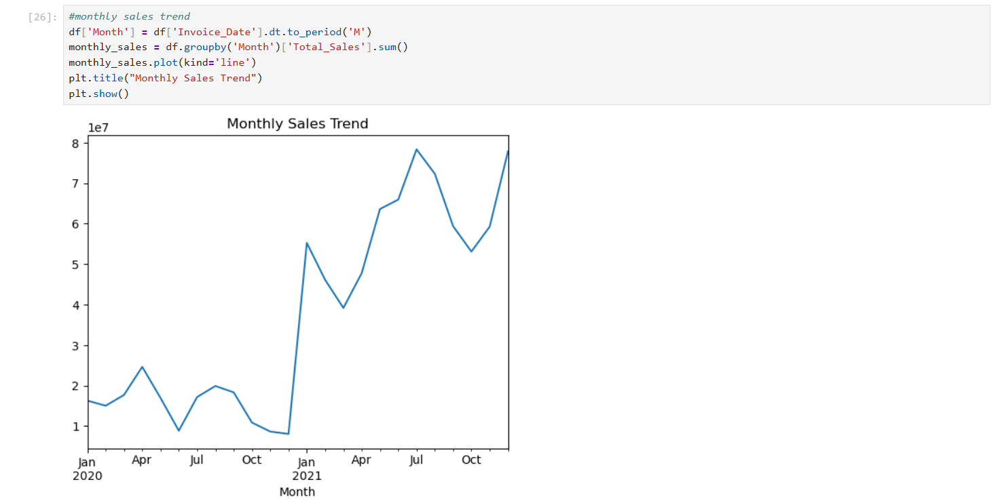 

## SQL Analysis SQL was used to perform revenue analysis, retailer ranking, regional performance evaluation, and monthly sales trend analysis.

## Top Product
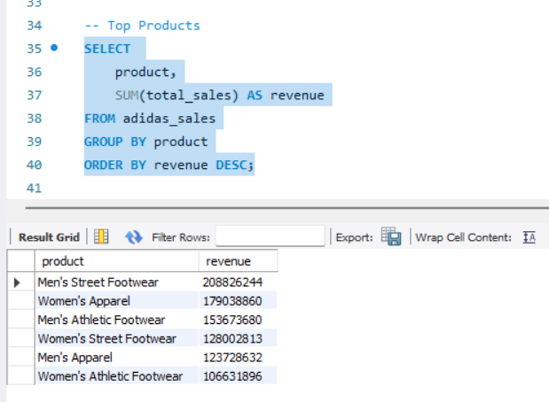

# Sales by Region
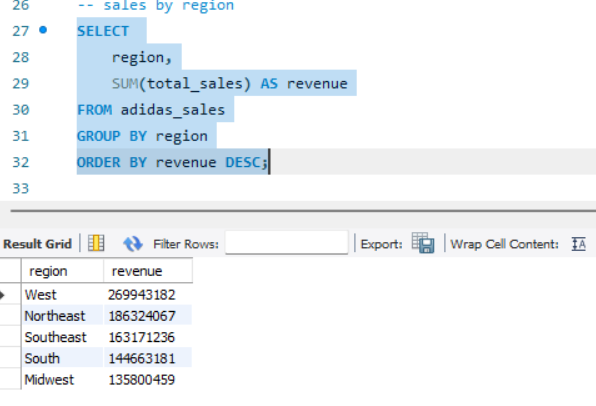

# Retailer Performance
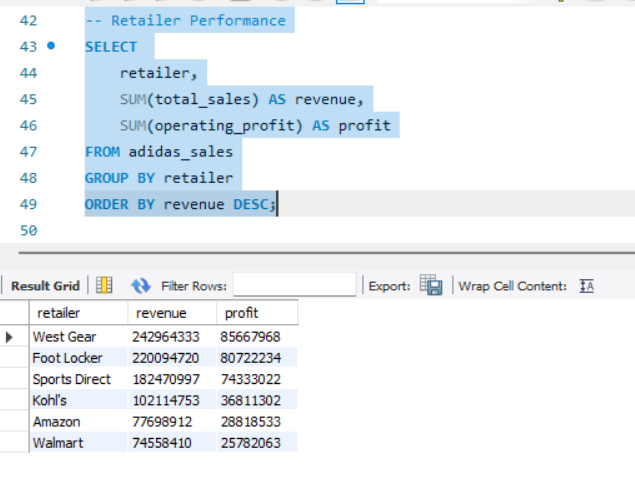

# Monthly Sales Trend Analysis
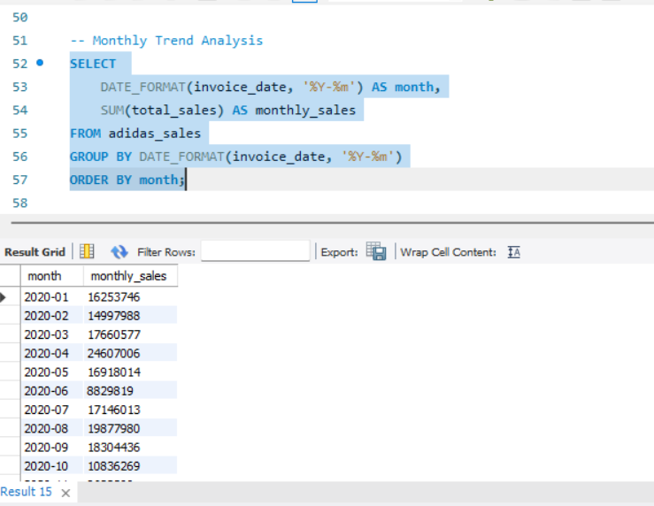

# Profit Margin Analysis
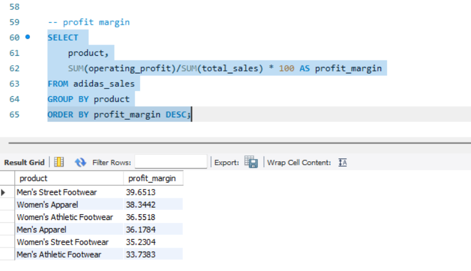    